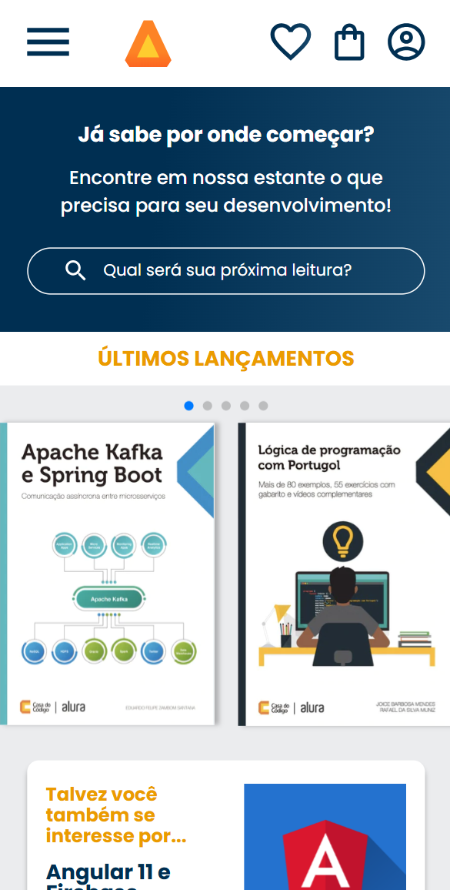
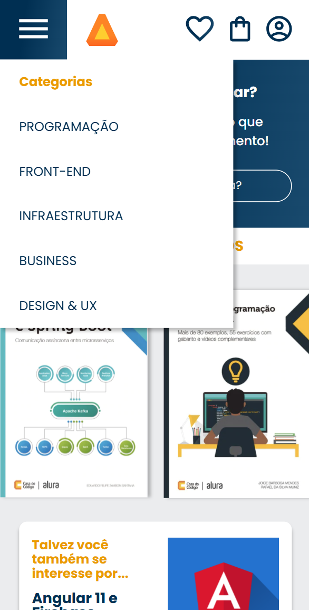

# Projeto desenvolvido durante curso de mobile-first na Alura.

 

## Ferramentas utilizadas:

* HTML

* CSS

* FLEXBOX

## Descrição

Projeto desenvolvido buscando o desenvolvimento da responsividade em mobile-first.

## Feito por:

### MNynee (Matheus Faustino)